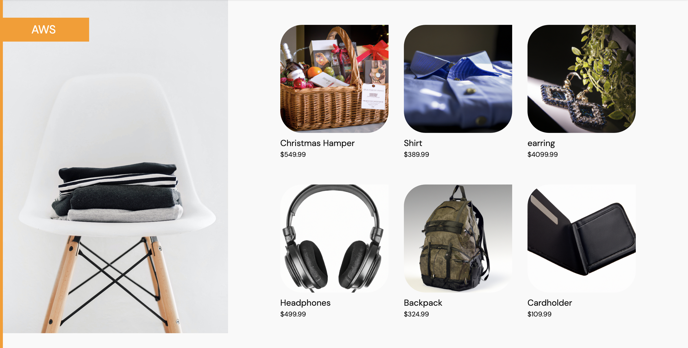
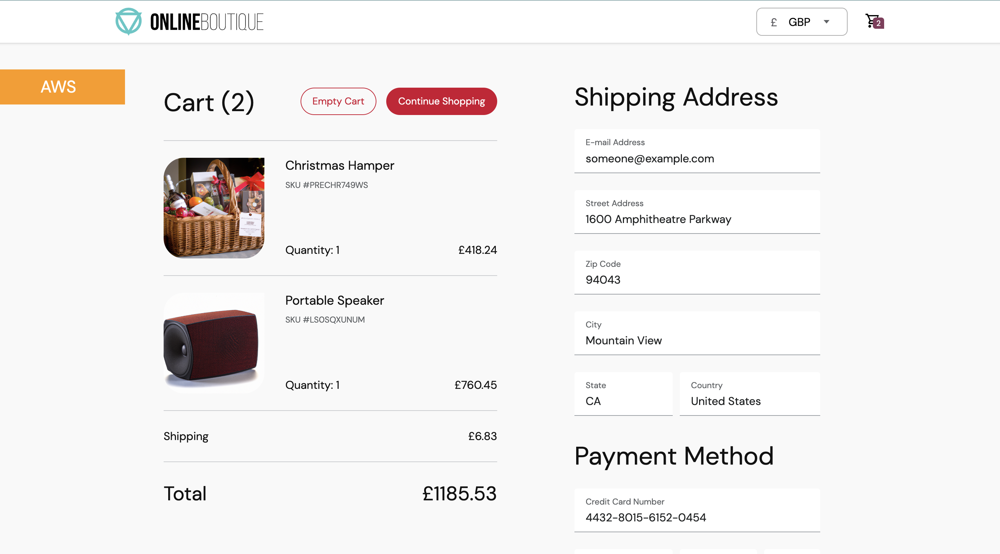

This Project is multiple Domains:
**Infrastructure**

**Microservices**

**Source Code**


**The Microservices**
<p align="center">

</p>


This is a fork of the **Online Boutique** unofficial microservices project by google which I have customised by adding some new products and changed to use  Github Action as the CI. 
A cloud-first microservices demo application.
**Online Boutique** consists of an 11-tier microservices application. The application is a web-based e-commerce app where users can browse items,
add them to the cart, and purchase them.

This application is used to demonstrate use of technologies like:

* Kubernetes/EKS
* Helm
* Github Action
* Ansible
* Shell
* AWS

**★Star** this repository to show your interest!

## Screenshots

| Home Page                                                                                                         | Checkout Screen                                                                                                    |
| ----------------------------------------------------------------------------------------------------------------- | ------------------------------------------------------------------------------------------------------------------ |
| [](./docs/img/homepage.png) | [](./docs/img/checkout.png) |

## Quickstart (MiniKube)

1. Install Minikube 
**[Instruction Here] (https://minikube.sigs.k8s.io/docs/start/)** or Skip if you already have minikube installed or any other kubernetes cluster ready

2. **Clone this repository.**

```
git clone https://github.com/kay-bluhuntr/microservices.git
cd microservices
```

3. Install Helm/Helm Chart
**[Helm can be installed from here](https://helm.sh/docs/intro/install/)**
Sample: Using MACOS here and brew
```
brew install helm
```

4. **Deploy the App to your cluster.**

```
cd kubernetes-services
chmod 700 deploy-services.sh destroy-service.sh
./deploy-service.sh
```

5. **Wait for the Pods to be ready.**

```
kubectl get pods -n microservices-development
```

After a few minutes, you should see:

```
NAME                                     READY   STATUS    RESTARTS   AGE
adservice-7cbb8b8d5-9mpnb                1/1     Running   0          24m
cartservice-b658577cd-7zsdp              1/1     Running   0          24m
checkoutservice-5f5d4fd4d5-f7w8v         1/1     Running   0          24m
currencyservice-6c69948596-4hc48         1/1     Running   0          24m
emailservice-684495c5c5-86tl2            1/1     Running   0          24m
frontend-557cdf6d85-b5lqf                1/1     Running   0          24m
paymentservice-d7698c59-tgg8j            1/1     Running   0          24m
productcatalogservice-7847d85c4f-wvjnv   1/1     Running   0          24m
recommendationservice-678c96557c-rmx9m   1/1     Running   0          24m
redis-cart-8ff648fcd-wpbrc               1/1     Running   0          24m
shippingservice-5cd7dff8bd-5x968         1/1     Running   0          24m
```

6. **Get the running services**
```
kubectl get svc -n microservices-development
```
You should see this:

```
NAME                    TYPE           CLUSTER-IP       EXTERNAL-IP   PORT(S)        AGE
adservice               ClusterIP      10.107.24.16     <none>        9555/TCP       71m
cartservice             ClusterIP      10.104.220.98    <none>        7070/TCP       71m
checkoutservice         ClusterIP      10.111.204.225   <none>        5050/TCP       71m
currencyservice         ClusterIP      10.106.40.115    <none>        7000/TCP       71m
emailservice            ClusterIP      10.109.236.165   <none>        5000/TCP       71m
frontend                ClusterIP      10.105.25.104    <none>        80/TCP         71m
frontend-external       LoadBalancer   10.96.155.57     <pending>     80:32082/TCP   71m
paymentservice          ClusterIP      10.100.231.231   <none>        50051/TCP      71m
productcatalogservice   ClusterIP      10.99.33.52      <none>        3550/TCP       71m
recommendationservice   ClusterIP      10.101.157.75    <none>        8080/TCP       71m
redis-cart              ClusterIP      10.104.170.237   <none>        6379/TCP       71m
shippingservice         ClusterIP      10.98.10.6       <none>        50051/TCP      71m
```

7. **Access the web frontend in a browser** 

```
kubectl port-forward deployment/frontend 8080:8080 -n microservices-development
```
http://localhost:8080

8. **Clean up**:

```
./destroy-services.sh
```

## Architecture

**Online Boutique** is composed of 11 microservices written in different
languages that talk to each other over gRPC.

[](./docs/img/architecture.png)


| Service                                              | Language      | Description                                                                                                                       |
| ---------------------------------------------------- | ------------- | --------------------------------------------------------------------------------------------------------------------------------- |
| [adservice](https://github.com/GoogleCloudPlatform/microservices-demo/tree/release/v0.3.9/src/adservice)                         | Java          | Provides text ads based on given context words.                                                                                   |
| [cartservice](./src/cartservice)                     | C#            | Stores the items in the user's shopping cart in Redis and retrieves it.                                                           |
| [checkoutservice](./src/checkoutservice)             | Go            | Retrieves user cart, prepares order and orchestrates the payment, shipping and the email notification.                            |
| [currencyservice](./src/currencyservice)             | Node.js       | Converts one money amount to another currency. Uses real values fetched from European Central Bank. It's the highest QPS service. |
| [emailservice](./src/emailservice)                   | Python        | Sends users an order confirmation email (mock).                                                                                   |
| [frontend](./src/frontend)                           | Go            | Exposes an HTTP server to serve the website. Does not require signup/login and generates session IDs for all users automatically. |
| [loadgenerator](./src/loadgenerator)                 | Python/Locust | Continuously sends requests imitating realistic user shopping flows to the frontend.                                              |
| [paymentservice](./src/paymentservice)               | Node.js       | Charges the given credit card info (mock) with the given amount and returns a transaction ID.                                     |
| [productcatalogservice](./src/productcatalogservice) | Go            | Provides the list of products from a JSON file and ability to search products and get individual products.                        |
| [recommendationservice](https://github.com/GoogleCloudPlatform/microservices-demo/tree/release/v0.3.9/src/recommendationservice) | Python        | Recommends other products based on what's given in the cart.                                                                      |
| [shippingservice](./src/shippingservice)             | Go            | Gives shipping cost estimates based on the shopping cart. Ships items to the given address (mock)                                 |

## Features

- **[Kubernetes](https://kubernetes.io):**
  The app is designed to run on Kubernetes (both locally on "Docker for
  Desktop" and Minikube, as well as on the cloud with GKE, AKS or EKS).
- **[gRPC](https://grpc.io):** Microservices use a high volume of gRPC calls to
  communicate to each other.

## Local Development

If you would like to contribute features or fixes to this app, see the [Development Guide](/docs/development-guide.md) on how to build this demo locally.
